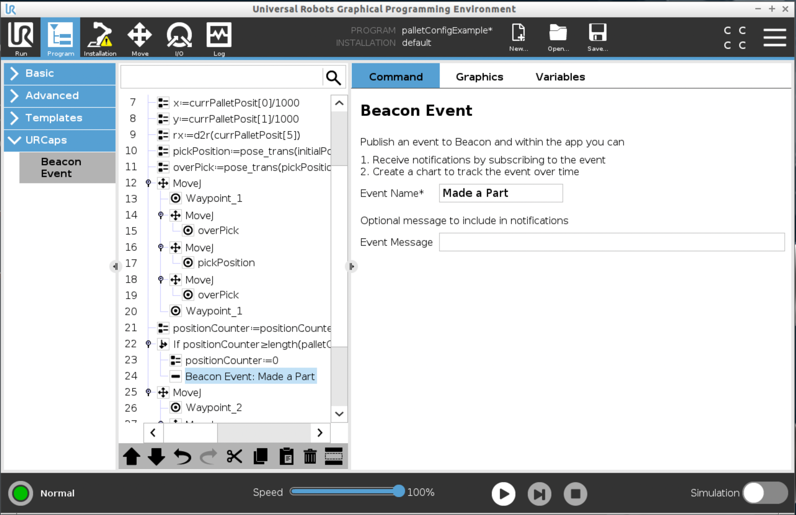
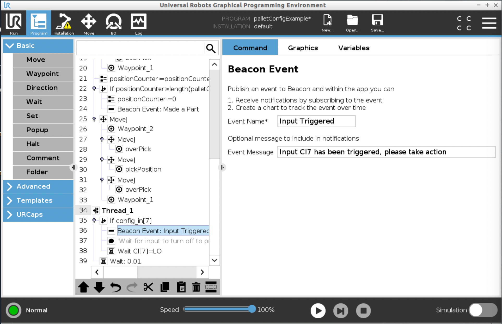
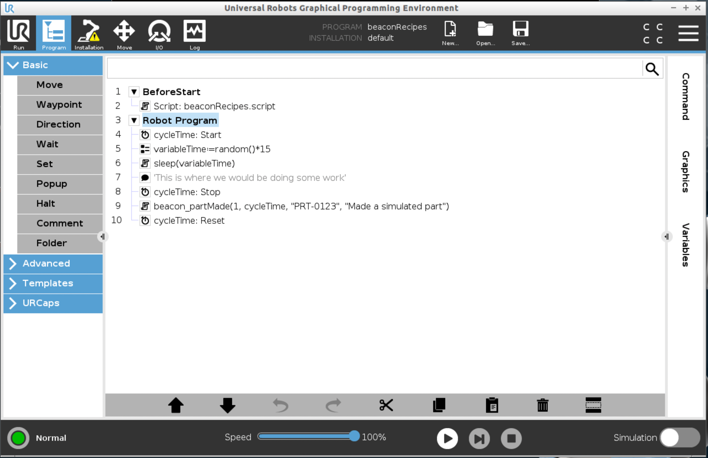
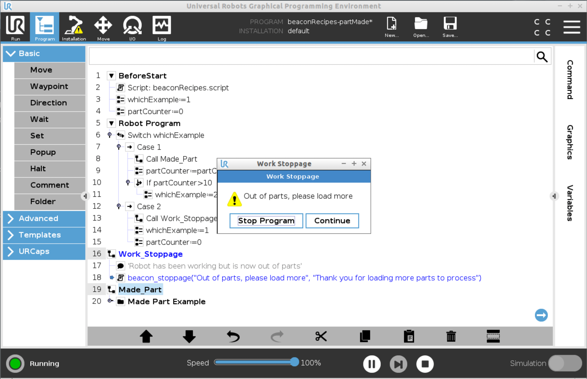
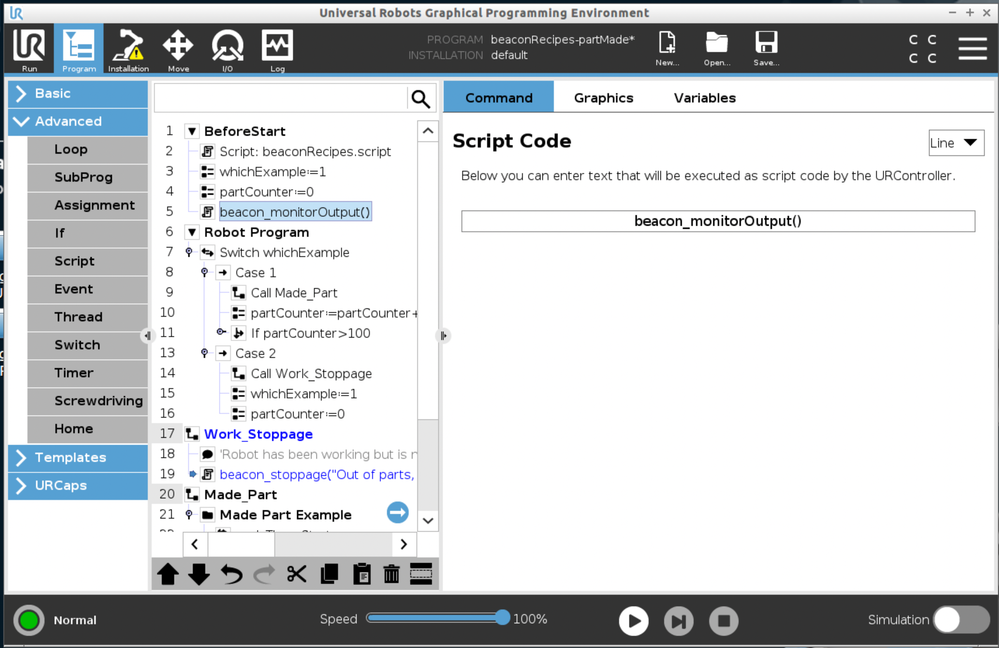
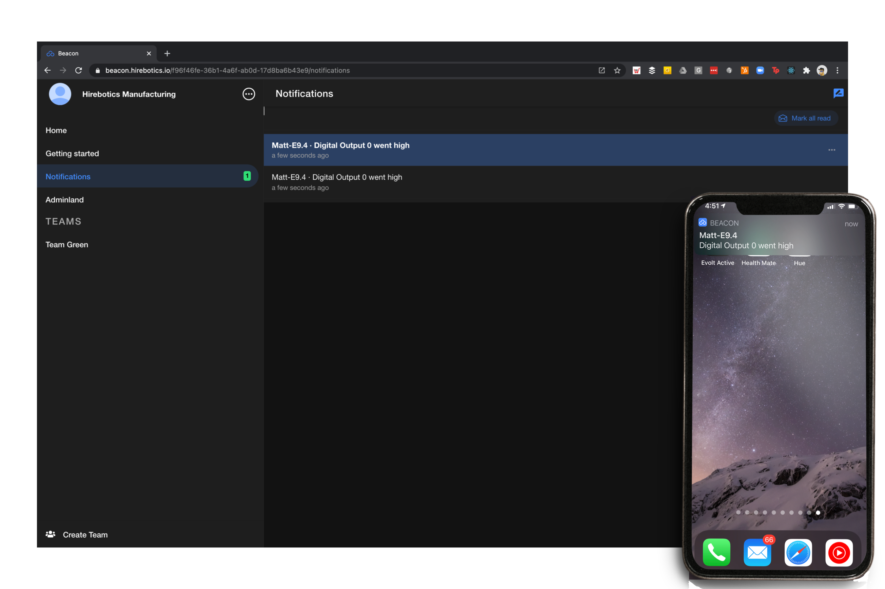
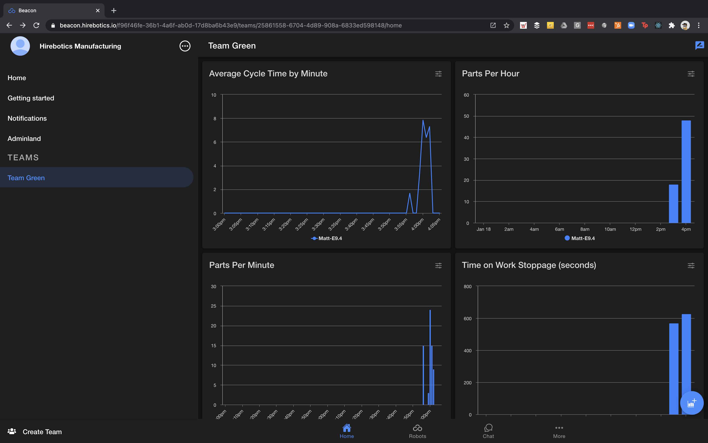
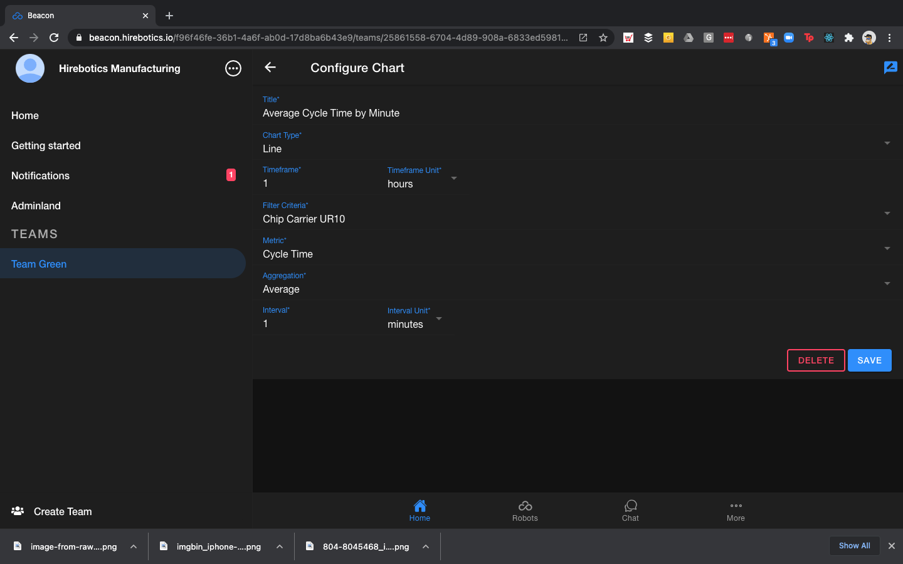

<h1 align="center"> Beacon Custom Event Recipes</h1>

<h2 align="center"> A set of preconfigured recipes to publish custom events on your Beacon powered robot</h2>


## Table of Contents

- [Overview](#overview)
- [Quick Start](#quick-start)
- [Publish Event with URScript](#publish-event-with-urscript)
- [Recipe Examples](#recipe-examples)
    - [Made a Part](#made-a-part)
    - [Production Stoppage](#production-stoppage)
    - [Notify When Output Triggered](#notify-when-output-triggered)
- [Charting in Beacon](#charting-in-beacon)
- [Advanced Repo Functionality](#advanced-repo-functionality)

## Overview

[Beacon](https://bit.ly/35TuHQ4) is a powerful platform for monitoring your Universal Robot cobot.  With the new custom event API you can now send up meaningful messages and metrics directly from the robot to your Beacon instance.


<div class="hs-cta-wrapper" id="hs-cta-wrapper-dd01f58d-3d2d-429d-9d15-f803b3e74f09" align="center" >
  <span class="hs-cta-node hs-cta-dd01f58d-3d2d-429d-9d15-f803b3e74f09" id="hs-cta-dd01f58d-3d2d-429d-9d15-f803b3e74f09">
     <!--[if lte IE 8]><div id="hs-cta-ie-element"></div><![endif]-->
     <a href="https://bit.ly/3qwRJEv"  target="_blank" >
        
     </a>
   </span>
 </div>

Beacon Recipes aims to make creating custom events easier by providing preconfigured scripts that you can use within your Polyscope program directly on the touch screen.  Using the URScript Tools package you can now bundle all of the recipes into a single file and if connected to your robot over the network push the bundled file directly to the robot.  Then you can simply call the functions from either Polyscope using the Script feature or within other URScript files.

## Quick Start

### Using the URCap to Publish Events
The easiest way you can publish an event to the Beacon system is to use the Beacon URCap.  When you do this the `Event Name` that you use in the program node will be available as a metric to use in dashboards.  This allows you to very easily add custom events to your Polyscope program without the need to know any URScript.  In this example we are adding the `Beacon Event` program node to an existing program to capture we have made a palleet of parts once the pallet is complete.  In our dashboard, `Made a Part` will be available as a metric, each time we submit an event with this method we will make 1 part in the system.



Here is another example where we are using a Polyscope thread node to monitor the condition of an input and then send an event when that input is triggered.



### Using URScript to Publish Events

One of the limitations of the URCap program node is you are limited on the data that can be sent with an event.  You are only able to send an `Event Name` and an optional `Event Message`.  The event name will automatically be converted to a metric key with a value of 1.  If you want to send more complex data you can use the URScript method to publish complex events.  We have provided several code recipes that you can use directly in your programs or modify them to do the exact function that you want.  If you come up with a recipe that you think would be useful to others you can contribute back to the community and make it available for others to use.

The easiest way to get started using the code recipes is to simply use the recipes as guides to create your own functions or programs on the UR Robot using Polyscope.  Another easy way to get started is use the download links in the examples below that will open the file in your web browser. To save the file you simply right click on the screen and choose `Save Page As` or `Save As` (depends on your browser) and that will allow you to directly save the content of the recipe to your computer or USB drive.  


## Publish Event with URScript
### Documentation
| Parameter | Type | Required | Description |
| --- | --- | ---| --- |
| eventName | String | Required | This is the event name that will be published to Beacon.  You can have multiple events that are sent to the same name, see [Production Stoppage](#production-stoppage) for an example |
| eventMessage | String | Optional | Message that you want to send when the event is published, this could be a message that is seen in a push notification for example, see [Notify When Output Goes High](#notify-when-output-triggered) |
| metrics | String \| Number | Optional | These are the values that will be availabe to chart.  To use Metrics you need to send both a `key` and a `value` as comma seperated fields, i.e., `..."Quantity Made", 1 ...` |


### Example Usage

```
local eventName = "Waiting"
local eventMessage = "Waiting for operator to clear the conveyor"
local metric_1_Key = "Time Spent Waiting"
local metric_1_Value = 12.34
local metric_2_Key = "Conveyor Line"
local metric_2_Value = "2"

beacon.publishEvent(eventName, eventMessage, metric_1_Key, metric_1_Value,  metric_2_Key, metric_2_Value)
```

## Recipe Examples

### Made a Part
  This is a good recipe to use when you want to track part production over the course of the day.  This script has optional parameters for sending in the `Part Number`, `Cycle Time` and a custom message that you want tagged in the event.  If you do not provide those values the `Part Number` will be set to an empty string and the `Cycle Time` will be set to a value of 0.

#### Documentation


| Parameter | Type | Required | Description |
| --- | --- | ---| --- |
| quantityMade | Number|  Required | Number of parts made during the cycle |
| cycleTime | Number | Optional | This is the cycle time it took the robot to make the part |
| partNumber | String | Optional | Part number that is being reported |
| msg | String | Optional | This message will be sent in the notification when the made a part event is sent |

```
def beacon_partMade(quantityMade, cycleTime = 0, partNumber = "", msg = ""):
  beacon.publishEvent("Made a Part", msg, "Quantity Made", quantityMade, "Cycle Time", cycleTime, "Part Number", partNumber)
end
```
  #### Example Usage:
  ```
  beacon_partMade(1, 12.34, "PRT-00123", "Made part from machine 1234")
  ```




### Production Stoppage

This is a recipe to use when you want to monitor work stoppages.  It will send a notification and also pop onto the screen the information for the operator on what needs to be addressed.  It also takes an optional second message that will be displayed once the operator acknowledges the situation.  The function automatically logs the amount of time it takes from when the stoppage occurs until the operator acknowledges the situation.

[Download](https://raw.githubusercontent.com/redwoodjs/learn.redwoodjs.com/master/docs/tutorial/a-second-page-and-a-link.md)

#### Documentation


| Parameter | Type | Required | Description |
| --- | --- | ---| --- |
| msg_start | String|  Required | This is the message that you want displayed in the popup when the stoppage occurs, will also be sent in the event |
| msg_end | String | Optional | This message will be sent in the event when the stoppage is resolved, if not provided the default message will be sent |

```

local stoppage_timer = 0
local step_time = get_steptime()

def beacon_stoppage(msg_start, msg_end = "Stoppage resolved, thank you for your help"):
  local threadId = run stoppage_thrd()
  beacon.publishEvent("Stoppage", msg_start)
  popup(msg_start, "Work Stoppage", True, False, True)
  kill threadId
  beacon.publishEvent("Stoppage", msg_end, "Time Stopped", stoppage_timer)
end

thread stoppage_thrd():
  stoppage_timer = 0
  while (True):
    stoppage_timer = stoppage_timer + step_time
    sync()
  end
end
```


#### Example Usage
```
beacon_stoppage("Out of parts, please load more then press continue", "Parts have been reloaded")
```



### Notify When Output Triggered

This is a demo recipe that shows the power of notifications.  In this example the robot is monitoring a standard digital output on the robot and sending an event notification when the output goes high (turns on.  If a user is subscribed to this event than it is possible to get a push notification on a mobile device when this condition occurs.


#### Documentation


```
thread notifyWhenOutputHigh():
  while (True):
    if (get_standard_digital_out(0)): #This could be any of the standard, configurable or tool outputs or inputs, just need to use correct function and port
      beacon.publishEvent("Output Triggered", "Digital Output 0 went high", "Output Triggered", 1)
      while (get_standard_digital_out(0)):
        sync()
      end
    end
    sync()
  end
end

def beacon_monitorOutput():
  run notifyWhenOutputHigh()
end
```
#### Example Usage
```
beacon_monitorOutput()
```



#### Example of Notifications



## Charting in Beacon

### Results of Charting



### Configuring a Chart



## Advanced Repo Functionality

Click [here](./docs/advancedRepoFunctionality.md) to learn more about the advanced functionality available in this repositrory. 