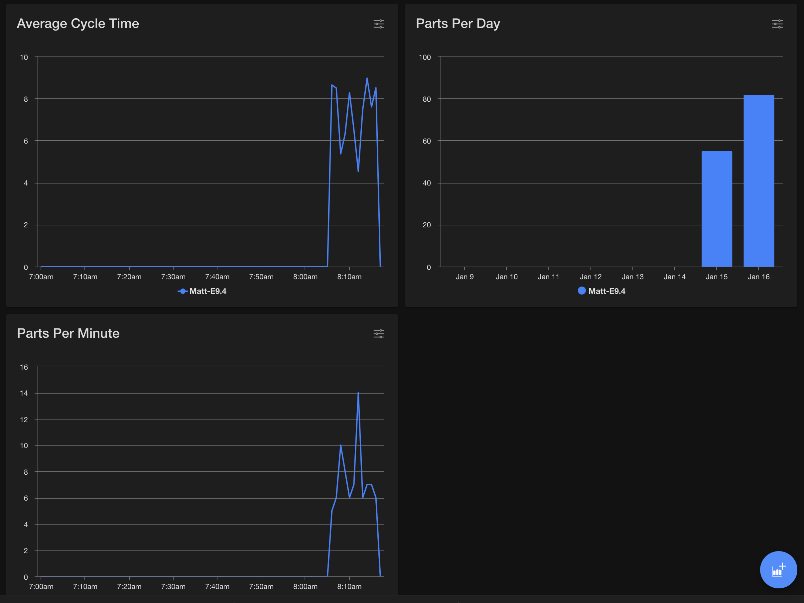
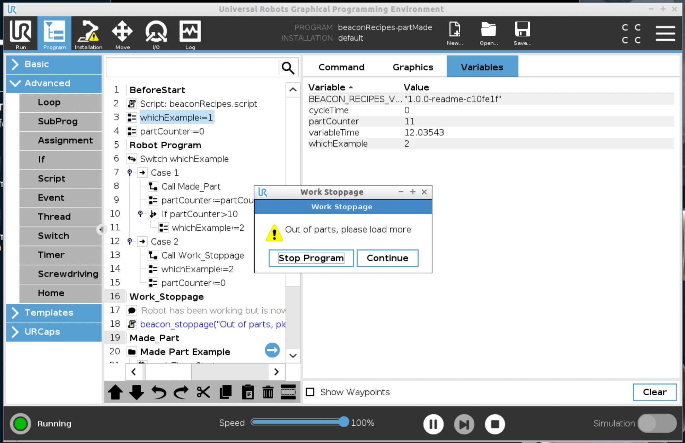

<h1 align="center"> Beacon Custom Event Recipes</h1>

<h2 align="center"> A set of preconfigured recipes to publish custom events on your Beacon powered robot</h2>


## Table of Contents

- [Overview](#overview)
- [Quick Start](#quick-start)
- [Documentation](#documentation)
    - [Made a Part](#made-a-part)
    - [Production Stoppage](#production-stoppage)

## Overview

[Beacon](https://www.hirebotics.com/beacon) is a powerful platform for monitoring your Universal Robot cobot.  With the new custom event API you can now send up meaningful messages and metrics directly from the robot to your Beacon instance.

<!--HubSpot Call-to-Action Code -->
<div class="hs-cta-wrapper" id="hs-cta-wrapper-dd01f58d-3d2d-429d-9d15-f803b3e74f09" align="center" >
  <span class="hs-cta-node hs-cta-dd01f58d-3d2d-429d-9d15-f803b3e74f09" id="hs-cta-dd01f58d-3d2d-429d-9d15-f803b3e74f09">
     <!--[if lte IE 8]><div id="hs-cta-ie-element"></div><![endif]-->
     <a href="https://hirebotics.com/beacon-sign-up"  target="_blank" >
        
     </a>
   </span>
        <script charset="utf-8" src="https://js.hscta.net/cta/current.js">
        </script>
        <script type="text/javascript"> hbspt.cta.load(5050021, 'dd01f58d-3d2d-429d-9d15-f803b3e74f09', {}); </script>
 </div><!-- end HubSpot Call-to-Action Code -->

Beacon Recipes aims to make creating custom events easier by providing preconfigured scripts that you can use within your Polyscope program directly on the touch screen.  Using the URScript Tools package you can now bundle all of the recipes into a single file and if connected to your robot over the network push the bundled file directly to the robot.  Then you can simply call the functions from either Polyscope using the Script feature or within other URScript files.

## Quick Start

The easiest way to get started using the code recipes is to simply use the recipes as guides to creating your own functions or programs on the UR Robot using Polyscope.  Another easy way to get started is to copy and paste the code from the source code into a text editor and then save that file on a USB and load it into the robot using that method.

## Advanced Functionality

Click [here](./docs/advancedRepoFunctionality.md) to learn more about the advanced functionality available in this repositrory. 

## Documentation

### Made a Part
  This is a good recipe to use when you want to track part production over the course of the day.  This script has optional parameters for sending in the `Part Number`, `Cycle Time` and a custom message that you want tagged in the event.  If you do not provide those values the `Part Number` will be set to an empty string and the `Cycle Time` will be set to a value of 0.

  #### Example Usage:
  ```
  beacon_partMade(1, 12.34, "PRT-00123", "Made part from machine 1234")
  ```


#### Example of Charting Results




### Production Stoppage

This is a recipe to use when you want to monitor work stoppages.  It will send a notification and also pop onto the screen the information for the operator on what needs to be addressed.  It also takes an optional second message that will be displayed once the operator acknowledges the situation.  The function automatically logs the amount of time it takes from when the stoppage occurs until the operator acknowledges the situation.

#### Example Usage
```
beacon_stoppage("Out of parts, please load more then press continue", "Parts have been reloaded")
```

#### Example Polyscope Program

